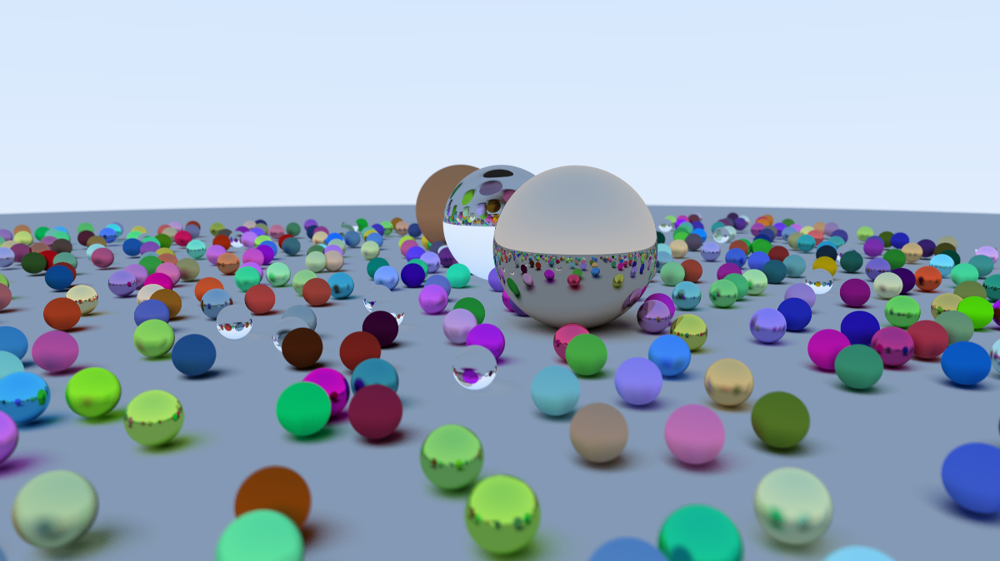

### Very Simple Ray Tracer

This is a very simple ray tracer, implemented in a few days because I wanted a quick introduction to computer graphics. It mostly follows [Ray Tracing in One Weekend](https://raytracing.github.io/books/RayTracingInOneWeekend.html), on top of which I've added multithreading support. 

# Features
- Anti-aliasing
- Reflection
- Refraction
- Defocus blur
- Positionable camera
- Multi-threading
- Spheres, lots of spheres 

Based on extremely unscientific measurements on my 8 logical-core i7-10610U, multithreading with 8-threads speeds up the rendering of a 225x400 image by 3-4x. 

# Future

This project is not under active development but at an indeterminate point in the future I intend to add some of the features (particularly bounding boxes and texture mapping) mentioned in [Ray Tracing in One Week](https://raytracing.github.io/books/RayTracingTheNextWeek.html)